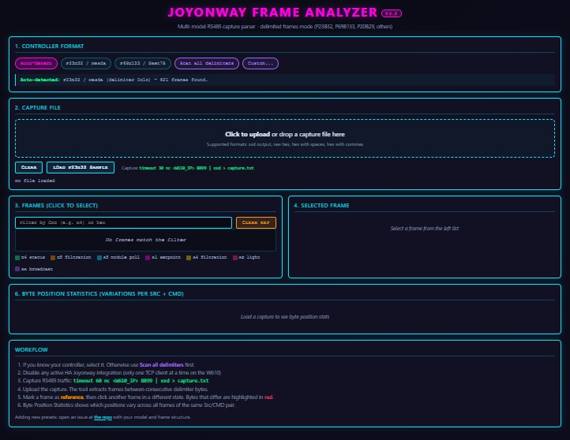
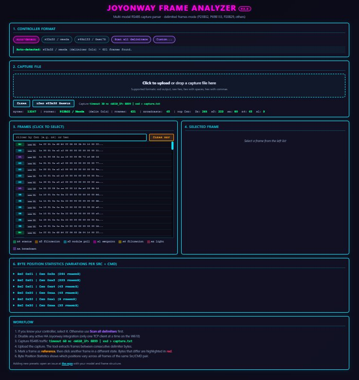

# Joyonway Frame Analyzer

[](https://opensource.org/licenses/MIT)
[](https://knapthebuilder.github.io/joyonway-frame-analyzer/)

An in-browser tool to analyze raw RS485 captures from Joyonway / Mesda / Balboa
spa controllers. Auto-detects frame format, extracts frames, performs byte-level
diff between states, and helps reverse engineer the binary protocol.

**Try it live: https://knapthebuilder.github.io/joyonway-frame-analyzer/**

No data leaves your browser. Everything runs client-side in pure HTML/JS.

## Screenshots

### Empty state — ready to receive a capture



### After loading a capture (621 frames extracted, 45 broadcasts identified)



## What it does

- Parses xxd hex dumps or raw hex captures from any source (W610 TCP bridge, ESP32+MAX485, USB-RS485 adapter, etc.)
- Auto-detects the frame format among known controller presets
- Handles the Joyonway pseudo-escape mechanism (1B XX sequences)
- Lists all frames with source, destination, command type
- Mark one frame as reference and diff any other frame against it, byte by byte
- Aggregates statistics per (Src, CMD) group to show which byte positions vary

## Supported controllers

| Model | Status | Frame format |
|-------|--------|--------------|
| P23B32 / Mesda | Validated | [1A][dst][src][len][...][CRC][1D] with pseudo-escape |
| P69B133 | Reference | [7E][len][F9 BF cmd ...][CRC][7E] |
| Custom | Always available | User-defined delimiter and offsets |

More presets will be added as the community contributes captures of other models. See [CONTRIBUTING.md](CONTRIBUTING.md).

## How to capture RS485 traffic from your spa

If your spa uses a W610 WiFi-to-RS485 bridge:

1. Stop any active integration or app talking to the bridge (only one TCP client at a time)
2. From any Linux machine on the same network, run:

```bash
timeout 60 nc YOUR_W610_IP 8899 | xxd > capture.txt
```

3. During the capture, change spa state on the keypad (setpoint, pump on/off, light, filtration)
4. Open the tool in your browser and drop the capture.txt file in the upload zone

## How to use the tool

1. **Format selection**: leave it on Auto-detect first. If 0 frames are found, switch to Scan all delimiters mode
2. **Upload your capture** (drag-drop or click)
3. **Read the stats**: how many frames, how many broadcasts, top commands
4. **Click a frame** to see its byte structure
5. **Mark as reference** then click another frame to see the differences
6. **Byte Position Statistics** groups frames by (Src, CMD) and shows which bytes vary

## How to contribute

This is a community tool for community reverse engineering. The best contributions are:

- **New controller captures**: open an issue with the `new-controller` template, attach a capture
- **Decoded byte mappings**: open an issue with the `capture-analysis` template
- **Bug reports**: open an issue with the `bug` template
- **Code improvements**: pull requests welcome, see [CONTRIBUTING.md](CONTRIBUTING.md)

## Credits

This tool exists thanks to the reverse engineering work of:

- **KDy** — RS485 framing analysis with oscilloscope, pseudo-escape mechanism, full Python decoder (HA forum post #90)
- **c0mpleX** — Broadcast frame samples for All Off, Filtration, Pumps, Bubbler, Light, Heater (HA forum post #83)
- **Gaet78** — Original P69B133 HACS integration
- **Yannickt26, Buecky, Neuro** and others on the [Home Assistant community thread](https://community.home-assistant.io/t/joyonway-spa-control/582344)

## License

MIT — see [LICENSE](LICENSE)

## Related projects

- [ha-joyonway-p23b32](https://github.com/KnapTheBuilder/ha-joyonway-p23b32) — Home Assistant integration for the P23B32 controller (uses the protocol decoded with this tool)
